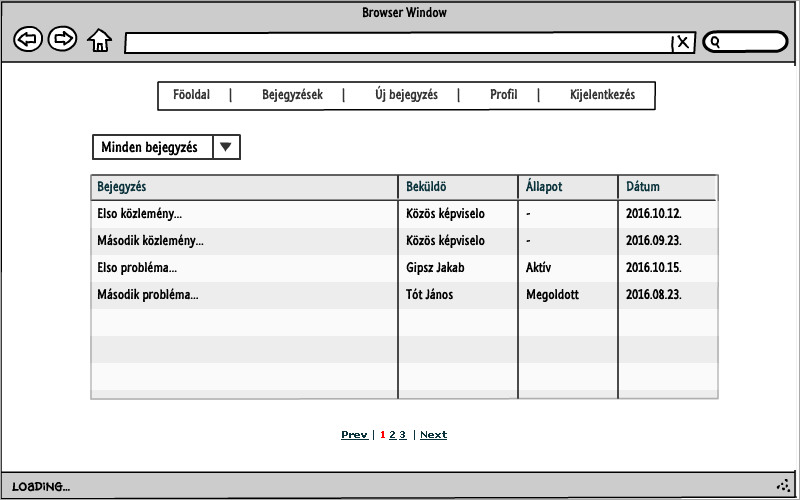

# Alkalmazások fejlesztése beadandó

## Társasházi lakóközösség feladatkezelő rendszere

Társasházi feladatkezelő rendszer, ami a társasházi lakóközösségben felmerülő feladatok/kérdések/problémák megvitatását és megoldását segíti. A felhasználók mindegyike hozhat létre új bejegyzést, illetve a bejegyzésekhez megjegyzés(eke)t fűzhet. A közös képviselő (admin) ezen felül az egyes bejegyzések állapotát is állíthatja, illetve a többi bejegyzéshez képest prioritást élvező közleményeket is közzé tehet a felületen. 

Adatok az admin felhasználóval történő belépéshez:
 * email: admin@admin.hu
 * jelszó: admin123

## Funkcionális követelmények

<ul><li>Felhasználóként szeretnék tudni bejelentkezni az oldalra </li>
<li>Felhasználóként szeretném látni a bejegyzések és közlemények listáját</li>
<li>Felhasználóként szeretném látni a saját bejegyzéseim, és a saját válaszaim listáit</li>
<li>Felhasználóként szeretnék tudni új bejegyzést közzétenni</li>
<li>Felhasználóként szeretnék tudni a bejegyzésekhez megjegyzést fűzni</li>
<li>Felhasználóként szeretném tudni szerkeszteni a profilom néhány adatát</li>
</ul>
Továbbá
<ul>
<li>Adminisztrátorként szeretném tudni állítani az egyes bejegyzések állapotát</li>
<li>Adminisztrátorként szeretnék tudni (adott határidőig) kiemelt közleményeket közzétenni</li>
</ul>

## Nem funkcionális követelmények

<ul>
<li>Felhasználóbarát, használhatóságot segítő elrendezés és kinézet</li>
<li>Gyors működés</li>
<li>Biztonságos működés – mindenki a jogosultságának megfelelő adatokhoz férhessen csak hozzá</li>
</ul>

## Végpontok

<ul>
<li>GET/: főoldal</li>
<li>POST/login: bejelentkező adatok felküldése</li>
<li>GET/logout: kijelentkező oldal</li>
<li>GET/register: regisztrációs oldal</li>
<li>POST/register: regisztrációs adatok felküldése</li>
<li>GET/messages: bejegyzéslista oldala</li>
<li>POST/messages/filter: bejegyzéslista szűréséhez adatok felküldése</li>
<li>GET//message/create: új bejegyzés felvitele</li>
<li>POST//message/create: új bejegyzés felviteléhez szükséges adatok felküldése</li>
<li>GET//statement/create: új közlemény felvitele</li>
<li>POST//statement/create: új közlemény felviteléhez szükséges adatok felküldése</li>
<li>GET/message/id: bejegyzés oldala</li>
<li>GET/statement/id: közlemény oldala</li>
<li>GET/message/id/edit: bejegyzés szerkesztése oldal</li>
<li>POST/message/id/edit: bejegyzés szerkesztéséhez szükséges adatok felküldése</li>
<li>POST/message/id/comment: bejegyzés kommentálásához szükséges adatok felküldése</li>
<li>GET/editProfile: profil oldal</li>
<li>POST/editProfile: profil szerkesztéséhez szükséges adatok felküldése</li>
</ul>

## Szerepkörök

Lakó (felhasználó): Bejegyzéseket listázhat, megtekinthet, azokra válaszolhat, illetve új bejegyzéseket tehet közzé.
Közös képviselő (admin): A felhasználó jogosultságain túl beállíthatja az egyes bejegyzések állapotát, illetve közzétehet (magas prioritású) közleményeket is.

## Használati esetek

## Folyamatok
### Bejelentkezés, új bejegyzés hozzáadása, új megjegyzés írása, státuszállítás:
   

## Oldaltérkép

### Lakó:

* Főoldal
* Kijelentkezés
* Bejegyzések
  * Bejegyzés megtekintése
    * Válasz írása
* Új bejegyzés
* Profil
  * Profil szerkesztése

### Közös képviselő:

* Főoldal
* Kijelentkezés
* Bejegyzések
  * Bejegyzés megtekintése
    * Válasz írása
    * Állapot beállítása
* Új bejegyzés
* Új közlemény
* Profil
  * Profil szerkesztése
  
## Oldalvázlatok

### Főoldal

### Lista oldal

### Új bejegyzés

### Bejegyzés oldala

## Adatmodell

# 3. beadandó

## A változásokban érintett fájlok:
 * UserController
 * MessageController
 * routes.js
 * master.njk
 * welcome.njk
 
Új fájlok:
 * ajaxReg.js
 * ajaxComment.js
 * ajaxCreate.js
 * imagePreview.js
 * logout.js

## Funkciók

* AJAX-os regisztráció (ajaxReg.js)
  * A nyitólapon a regisztráció gombra kattintva felugró ablakban adhatjuk meg a szükséges adatokat. 
  Hibás adatok esetén itt kapunk hibaüzenetet is, ha nincs hiba, megtörténik a regisztráció.
* AJAX-os kommentelés (ajaxComment.js)
  * Hozzászólás küldése ajaxos megoldással
* AJAX-os új bejegyzés (ajaxCreate.js)
  * Új bejegyzés küldésénél előbb megerősítést kér a rendszer, majd, ha a felhasználó a beküldés mellett dönt, ajaxos megoldással megtörténik a bejegyzés beküldése.
* Kép előnézet (imagePreview.js)
  * Új bejegyzés/közlemény beküldésénél, ha a felhasználó megad képhez tartozó URL-t, megjelenik a kép előnézeti képe, vagy egy hibaüzenet, ha a beírt címen 
  nem talál (megjeleníthető) képet a rendszer.
* Kijelentkezés megerősítése (logout.js)
  * A kijelentkezés gombra kattintva felugró ablak jelenik meg, kérve a kijelentkezés megerősítését.

## Tesztek

A tesztek Selenium IDE használatával készültek, valamint azzal futtathatók. A bővítményben a base URL mezőt be kell állítani a megfelelő értékre (alapesetben localhost:3333), majd a tesztet importálni (File/Open Test Suite).
Ekkor mind az öt teszt egymás után sorban futtatható. A tesztesetek egyesével is importálhatóak és futtathatóak, de az előző módszer használata célszerűbb, mivel egyes tesztek (részben) egymásra is épülnek. 
Az elkészített tesztek:

* registration
  * A regisztrációt teszteli. Elsőre hibás adatot ad meg, másodjára megfelelően kitölti az űrlapot, és regisztrálja a felhasználót.
* editProfile
  * A felhasználó profil adatainak módosítása (email)
* createMessage
  * Új bejegyzés létrehozása
* commentMessage
  * Az előbbi bejegyzéshez hozzászólás fűzése, majd szűrés a bejegyzéslistában a felhasználó által kommentált bejegyzésekre.
* editByAdmin
  * Kijelentkezés a felhasználóval, majd bejelentkezés adminként. Az előbb létrehozott bejegyzés állapotának módosítása és kiegészítés hozzáfűzése.
